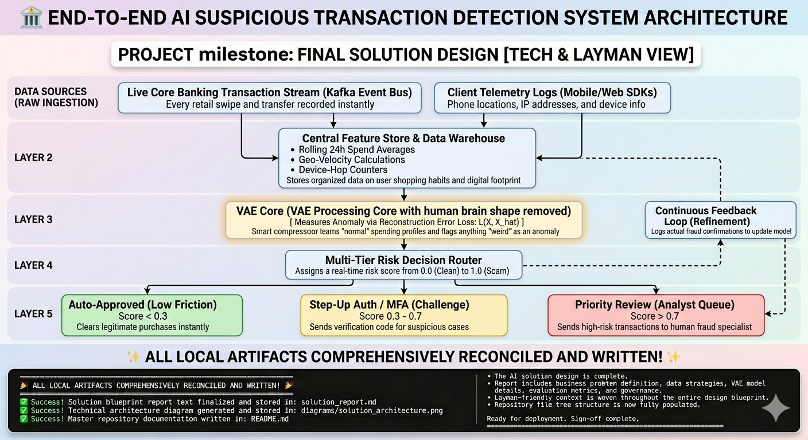

# 🏦 AI Solution Design: Suspicious Transaction Detection Pipeline

This repository hosts the full engineering and business architecture design for an enterprise-ready **AI Suspicious Transaction Detection Pipeline**. The core engine leverages semi-supervised anomaly detection to stop modern banking fraud in real-time.

---

## 📂 Repository File Tree

* **`solution_report.md`**: The master design report containing deep-dive technical math paired with plain English justifications across all project pillars.
* **`diagrams/`**: Central repository asset store.
  * `solution_architecture.png`: The end-to-end technical and layman system processing blueprint.

---

## 🛠️ End-to-End System Pipeline

The pipeline processes high-volume bank data layers and delivers automated risk routing decisions in under 15 milliseconds:

---

## ⚡ Quick-Start Solution Summary

For detailed breakdowns of data specs, VAE loss equations, and ethical safeguards, open the full [solution_report.md](./solution_report.md).

| Pillar | Tech Context | Layman Summary |
| :--- | :--- | :--- |
| **🚨 The Problem** | Binary, threshold-based legacy rules generate high false alarm rates ($\ge 10:1$) and miss non-linear zero-day fraud vectors. | Old security systems rely on rigid rules that miss smart scammers, creating huge backlogs and freezing innocent customer accounts. |
| **🤖 The AI Solution** | Semi-Supervised Variational Autoencoder (VAE) measuring anomalous data patterns via Reconstruction Error profiles. | A smart engine that learns what *normal* customer shopping looks like. If a card acts out of character, it instantly flags the anomaly. |
| **📊 Ingest Streams** | Real-time Kafka logs, user aggregated spending windows, client-side IP reputation lists, and geo-velocity arrays. | Core banking details (money and timing) matched with phone app location sensors and device tracking metrics. |
| **🔀 Decision Logic** | Multi-tiered routing utilizing a cost-sensitive Feed-Forward prediction layer ($P \in [0, 1]$). | **Score < 0.3:** Auto-Approved. **Score 0.3 - 0.7:** Step-Up Verification (MFA). **Score > 0.7:** Frozen & sent to Human Fraud Analysts. |

---
*Generated under professional AI Governance and Solution Design criteria.*
